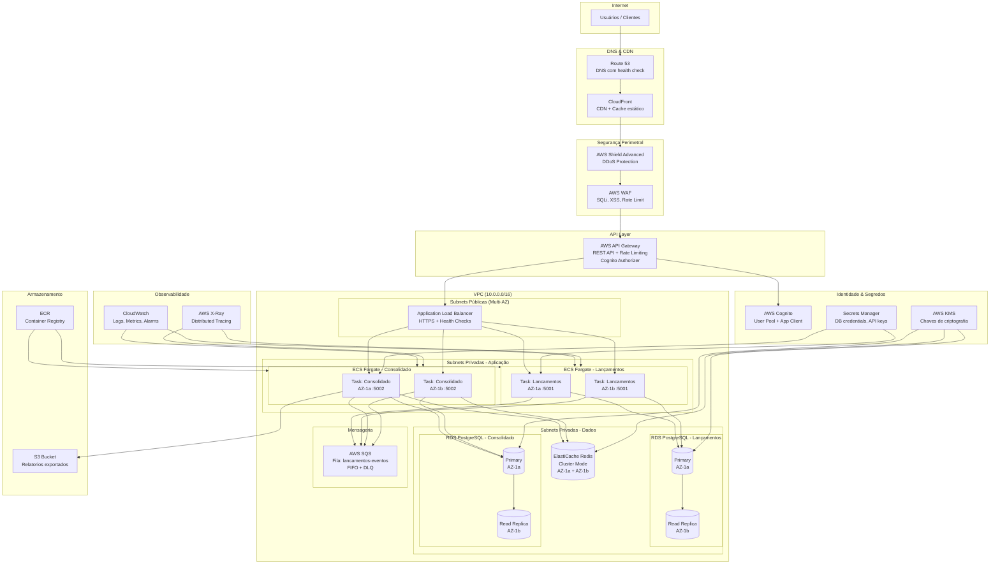

# Infraestrutura AWS - Fluxo de Caixa

## Diagrama Completo da Infraestrutura

---

## Componentes Detalhados

### Route 53
- **Tipo**: Public Hosted Zone
- **Registros**: `api.fluxocaixa.com.br` → CloudFront
- **Health Checks**: Verifica `/health` dos serviços a cada 30s
- **Failover**: Automático para região secundária se health check falhar

### CloudFront
- **Origem**: API Gateway (API) e S3 (frontend estático)
- **Cache**: TTL 0 para API, TTL 86400 para assets estáticos
- **Behaviors**: `/api/*` sem cache; `/*` com cache longo
- **Geo-restriction**: Apenas Brasil (opcional)
- **TLS**: Certificate Manager (ACM) — TLS 1.2 mínimo

### AWS Shield
- **Nível**: Shield Advanced (proteção L3/L4/L7)
- **DDoS**: Mitigação automática de SYN floods, UDP floods
- **Response Team**: AWS DRT disponível 24/7

### AWS WAF
- **Rules**: AWSManagedRulesCommonRuleSet (SQLi, XSS, CSRF)
- **Rate Limit**: 2000 req/5min por IP
- **Custom Rules**: Block países de alto risco, block user-agents conhecidos
- **Logs**: Enviados para S3 + CloudWatch

### API Gateway
- **Tipo**: REST API (Regional)
- **Auth**: Cognito Authorizer + JWT validation (incluindo Issuer)
- **Rate Limit**: 10.000 req/s (burst: 5.000)
- **Throttling por rota**: `/lancamentos` 100 req/s; `/consolidado` 500 req/s
- **CORS**: Configurado via API Gateway
- **WAF**: Integrado ao WAF

### ECS Fargate
- **Lançamentos**: 2 tasks mínimo, 10 máximo; CPU 512, Memory 1024
- **Consolidado**: 2 tasks mínimo, 20 máximo; CPU 256, Memory 512
- **Auto Scaling**: Target Tracking (CPU 70%, Memory 70%)
- **Health Check**: `/health` a cada 30s, 2 falhas = replace
- **Deploy**: Rolling update (maxSurge: 100%, maxUnavailable: 0%)

### RDS PostgreSQL
- **Engine**: PostgreSQL 16
- **Multi-AZ**: Sim (failover automático < 60s)
- **Instance**: db.t3.medium (prod), db.t3.micro (dev)
- **Storage**: 100 GB gp3, autoscaling até 1TB
- **Backup**: Diário às 03:00 UTC, retenção 7 dias
- **Encryption**: KMS at-rest
- **Performance Insights**: Habilitado

### ElastiCache Redis
- **Engine**: Redis 7.x
- **Cluster Mode**: Habilitado (3 shards, 2 réplicas)
- **Instance**: cache.t3.medium
- **TLS**: In-transit encryption
- **Auth**: Redis AUTH token
- **Eviction**: allkeys-lru
- **TTL Padrão**: 300s (5 minutos)

### SQS (Mensageria)
- **Tipo**: FIFO Queue (garantia de ordem por dia)
- **DLQ**: Dead Letter Queue após 3 tentativas
- **Visibilidade**: 30 segundos
- **Retenção**: 7 dias
- **Encryption**: SSE-SQS
