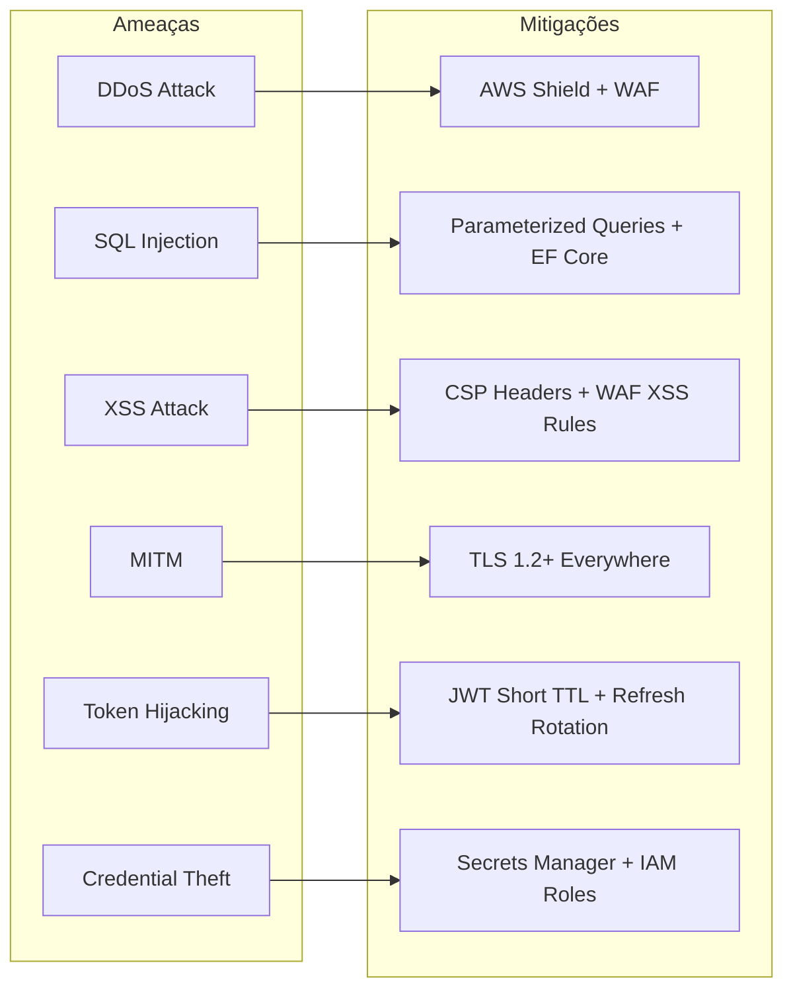
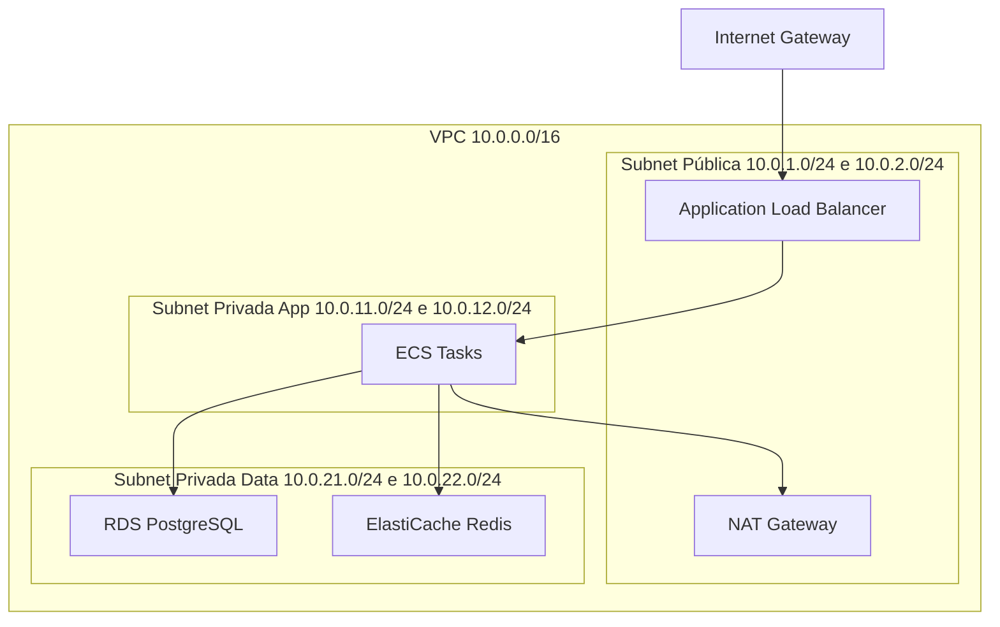

# Segurança - Fluxo de Caixa AWS

## Modelo de Ameaças



## Camadas de Segurança

### Camada 1: Perímetro
- **Route 53**: DNSSEC habilitado
- **CloudFront**: HTTPS obrigatório, TLS 1.2 mínimo, HSTS habilitado
- **AWS Shield Advanced**: Proteção DDoS L3/L4/L7
- **AWS WAF Rules**:
  ```
  AWSManagedRulesCommonRuleSet     → SQLi, XSS, LFI, RFI
  AWSManagedRulesSQLiRuleSet       → SQL Injection avançado
  AWSManagedRulesKnownBadInputsRuleSet → Log4j, Spring4Shell
  RateLimitingRule                 → 2000 req/5min por IP
  GeoBlockRule                     → Bloqueia GEOs de alto risco
  ```

### Camada 2: API Gateway
- **Cognito Authorizer**: Valida JWT (assinatura, expiração, **issuer**)
- **Rate Throttling**: Por rota e por usuário
- **Request Validation**: Schema validation automática
- **Resource Policy**: Permite apenas CloudFront como origem
- **TLS**: Certificado ACM, mTLS opcional

### Camada 3: Aplicação
- **JWT Claims**:
  - `iss`: Validado (deve ser o Cognito User Pool)
  - `aud`: Validado (deve ser o App Client ID)
  - `exp`: Validado (token não expirado)
  - `sub`: Extraído como UserId
  - `cognito:groups`: Extraído como Roles
- **CORS**: Lista branca de origens por ambiente
- **Rate Limiting**: AspNetCoreRateLimit por IP e por usuário
- **Input Validation**: FluentValidation em todas as commands
- **Output Sanitization**: Serialização controlada (sem circular refs, sem dados sensíveis)

### Camada 4: Rede (VPC)


**Security Groups**:
| SG | Inbound | Outbound |
|----|---------|----------|
| sg-alb | 443 de 0.0.0.0/0 | 5001,5002 para sg-ecs |
| sg-ecs | 5001,5002 de sg-alb | 5432 para sg-rds; 6379 para sg-redis; 443 para 0.0.0.0/0 |
| sg-rds | 5432 de sg-ecs | Nenhum |
| sg-redis | 6379 de sg-ecs | Nenhum |

### Camada 5: Dados
- **RDS**: Encryption at-rest com KMS; TLS in-transit
- **Redis**: AUTH token + TLS in-transit + encryption at-rest
- **S3**: SSE-S3 ou SSE-KMS; Block Public Access habilitado
- **Secrets Manager**: Credenciais de banco, Redis AUTH, API keys
- **KMS**: Customer Managed Keys (CMK) rotacionadas anualmente

### Camada 6: Identidade (IAM)
- **ECS Task Role** (Princípio do mínimo privilégio):
  ```json
  {
    "Lançamentos Task Role": ["sqs:SendMessage", "secretsmanager:GetSecretValue", "kms:Decrypt"],
    "Consolidado Task Role": ["sqs:ReceiveMessage", "sqs:DeleteMessage", "secretsmanager:GetSecretValue", "s3:PutObject"]
  }
  ```
- **GitHub Actions Role**: Apenas `ecr:GetAuthorizationToken`, `ecr:BatchGetImage`, `ecs:UpdateService`

## Observabilidade de Segurança
- **CloudTrail**: Auditoria de todas as chamadas de API AWS
- **GuardDuty**: Detecção de ameaças ML-based
- **Security Hub**: Visão unificada de postura de segurança
- **VPC Flow Logs**: Tráfego de rede para análise
- **WAF Logs**: Requests bloqueados em S3 + Athena para queries
