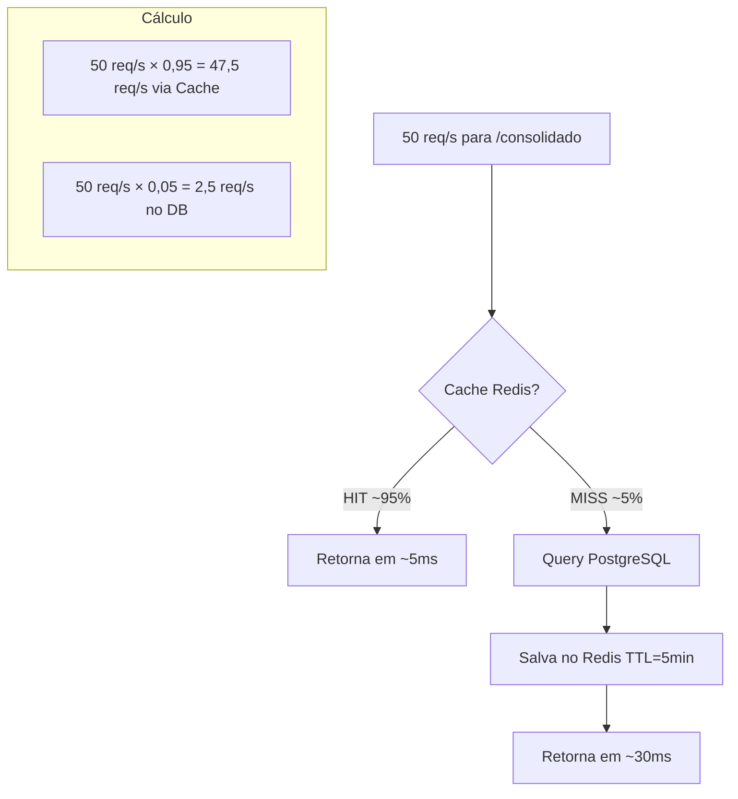
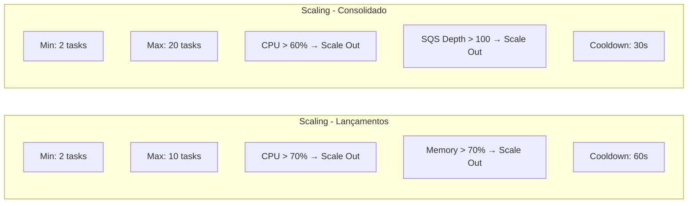
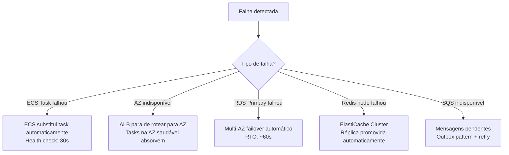
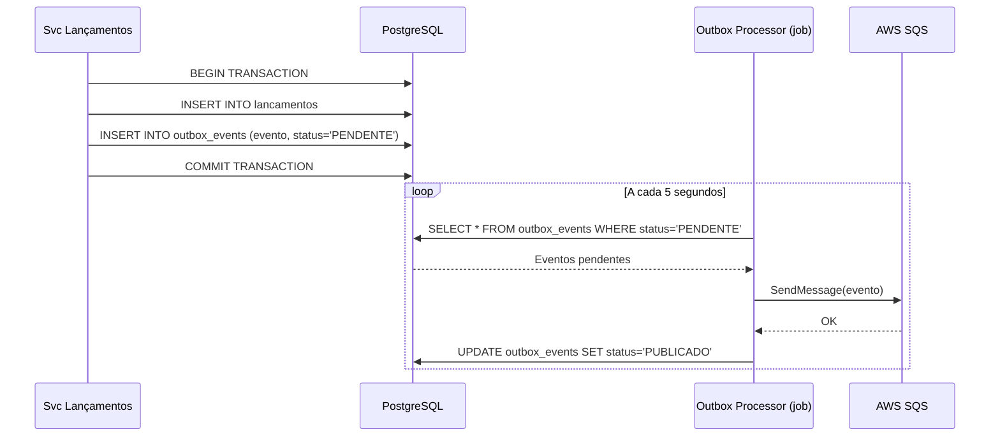

# Escalabilidade e Resiliência - Fluxo de Caixa

## SLAs Definidos

| Métrica | Meta | Medição |
|---------|------|---------|
| Disponibilidade | 99,9% (8,7h/ano downtime) | CloudWatch Synthetics |
| Lançamentos - P50 | < 50ms | X-Ray traces |
| Lançamentos - P99 | < 200ms | X-Ray traces |
| Consolidado - P50 (cache) | < 20ms | X-Ray traces |
| Consolidado - P99 | < 100ms | X-Ray traces |
| Consolidado - Throughput | 50 req/s com < 5% perda | CloudWatch metrics |
| RPO | 1 hora | RDS backup interval |
| RTO | 5 minutos | Multi-AZ failover |

## Estratégia de Cache para 50 req/s



**Cache Hit Rate alvo: 95%** → apenas 2,5 req/s atingem o banco.
Com 50 req/s e cache de 5 min: primeira requisição de cada [dia × 5min-slot] vai ao banco; as demais usam cache.

## Auto Scaling ECS



### Target Tracking Policy
```json
{
  "TargetValue": 70.0,
  "PredefinedMetricSpecification": {
    "PredefinedMetricType": "ECSServiceAverageCPUUtilization"
  },
  "ScaleOutCooldown": 60,
  "ScaleInCooldown": 300
}
```

## Circuit Breaker com Polly

O serviço de Lançamentos usa Polly para:
- **Retry**: 3 tentativas com backoff exponencial ao publicar no SQS
- **Circuit Breaker**: Abre após 5 falhas consecutivas (janela 30s)
- **Timeout**: 5 segundos por operação

```csharp
// Configuração Polly no serviço
services.AddHttpClient<IConsolidadoClient>()
    .AddTransientHttpErrorPolicy(p =>
        p.WaitAndRetryAsync(3, _ => TimeSpan.FromSeconds(2)))
    .AddTransientHttpErrorPolicy(p =>
        p.CircuitBreakerAsync(5, TimeSpan.FromSeconds(30)));
```

## Estratégia de Failover



## Padrão Outbox

Garante que nenhum evento seja perdido:



## CloudWatch Alarms

| Alarm | Threshold | Ação |
|-------|-----------|------|
| ECS CPU > 80% | 5 min | SNS → Scale Out |
| RDS CPU > 75% | 5 min | SNS → Notificação |
| SQS DLQ > 0 | Imediato | SNS → Alerta crítico |
| Redis Memory > 80% | 5 min | SNS → Scale Up |
| Error Rate > 5% | 1 min | SNS → Alerta crítico |
| P99 Latency > 500ms | 5 min | SNS → Investigação |

## Disaster Recovery

| Cenário | RPO | RTO | Procedimento |
|---------|-----|-----|--------------|
| Falha de task ECS | 0 | 30s | Auto-healing ECS |
| Falha de AZ | 0 | 60s | Multi-AZ automático |
| Falha de região | 1h | 30min | Restore RDS backup na região DR |
| Corrupção de dados | 1h | 2h | Point-in-time recovery RDS |
| Incidente de segurança | - | 4h | Isolamento + restore snapshot limpo |
