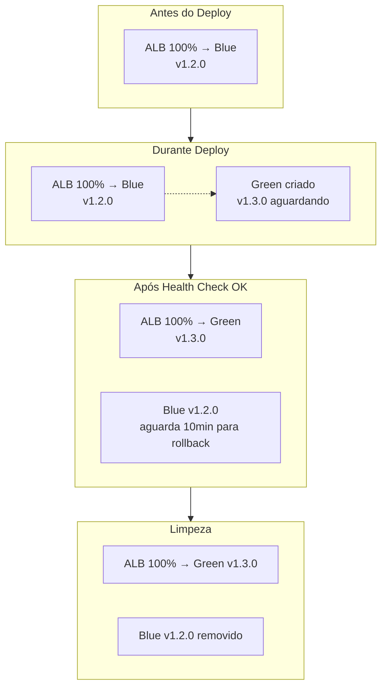
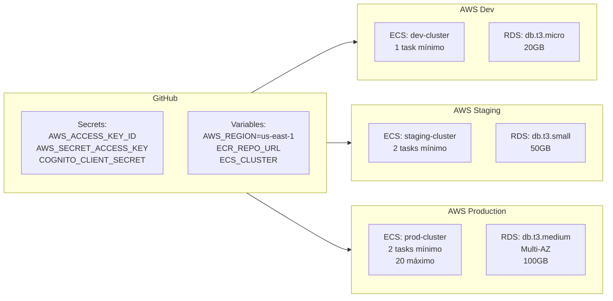

# Pipeline CI/CD - Fluxo de Caixa

## Visão Geral do Pipeline

```mermaid
flowchart LR
    subgraph DEV["Desenvolvimento"]
        CODE[Push / PR]
        LINT[Lint + Format]
        TEST_U[Unit Tests]
        TEST_I[Integration Tests]
        SONAR[SonarCloud\nCode Quality]
    end

    subgraph BUILD["Build & Package"]
        DOCKER[Docker Build]
        ECR[Push para ECR]
        SCAN[Trivy Security Scan]
    end

    subgraph STAGING["Staging"]
        DEP_STG[Deploy ECS Staging]
        SMOKE[Smoke Tests]
        PERF[k6 Performance Tests]
    end

    subgraph APPROVAL["Aprovação"]
        MANUAL[Aprovação Manual\nTécnico Responsável]
    end

    subgraph PROD["Produção"]
        DEP_PROD[Blue/Green Deploy ECS]
        HEALTH[Health Checks]
        MONITOR[Monitoramento 30min]
        ROLLBACK{Rollback\nnecessário?}
    end

    CODE --> LINT --> TEST_U --> TEST_I --> SONAR
    SONAR --> DOCKER --> ECR --> SCAN
    SCAN --> DEP_STG --> SMOKE --> PERF
    PERF --> MANUAL --> DEP_PROD --> HEALTH --> MONITOR --> ROLLBACK
    ROLLBACK -->|Sim| PREV[Versão anterior]
    ROLLBACK -->|Não| DONE[Deploy completo]
```

## Ambientes

| Ambiente | Branch | Deploy | Aprovação |
|----------|--------|--------|-----------|
| Development | `feature/*`, `develop` | Automático (PR) | Não |
| Staging | `main` | Automático | Não |
| Production | `main` (tag v*) | Automático após aprovação | Sim |

## Estratégia Blue/Green

## Configuração dos Ambientes

## Versionamento

- **SemVer**: `MAJOR.MINOR.PATCH` (ex: `v1.3.2`)
- **Tags de release**: Trigger automático de deploy para produção
- **Container tags**: `{version}` + `{commit-sha}` + `latest`
- **Rollback**: Basta re-taggear a versão anterior no ECR e re-deployar

## Monitoramento Pós-Deploy

Após deploy em produção, pipeline monitora por 30 minutos:
- Error rate < 1% (CloudWatch)
- P99 latency < 300ms (X-Ray)
- Health checks verdes (ECS)
- Zero alarmes críticos (CloudWatch)

Se qualquer métrica falhar → rollback automático para versão anterior.
