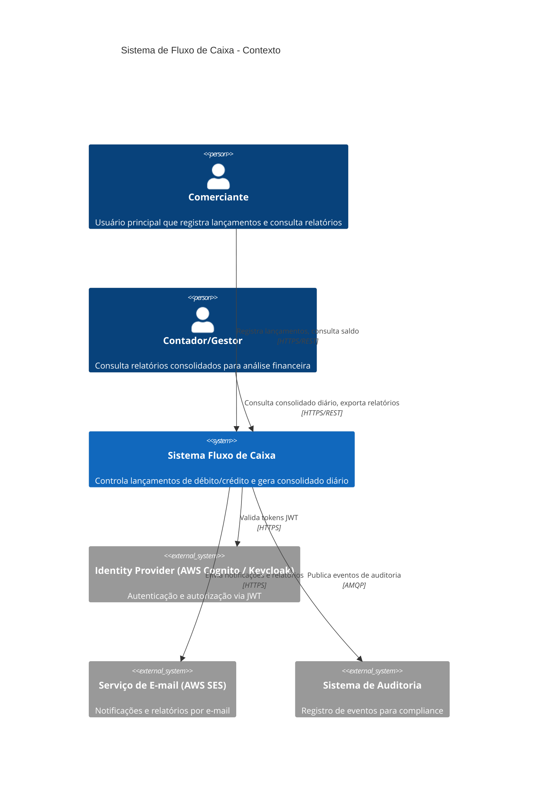
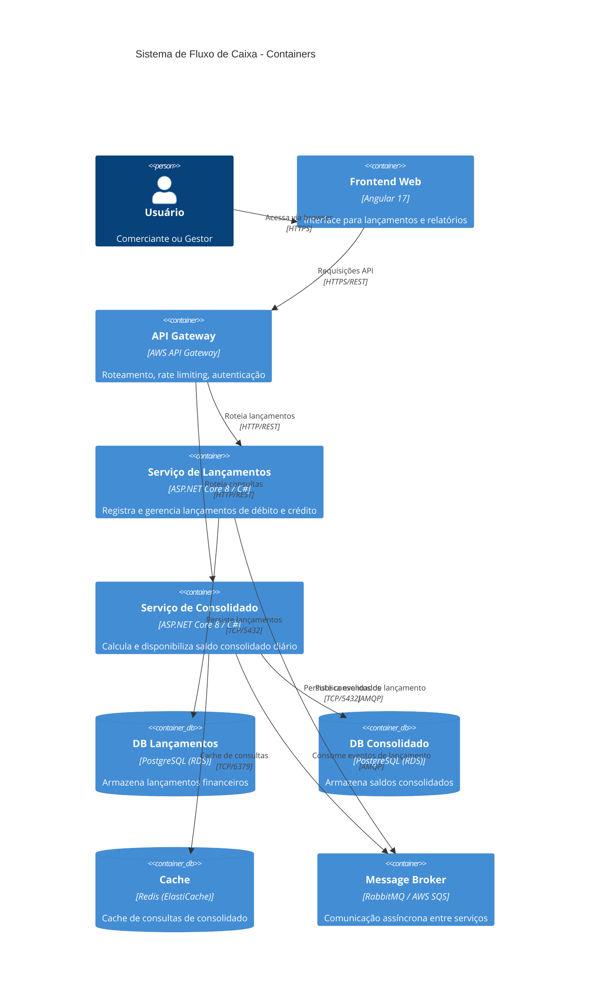
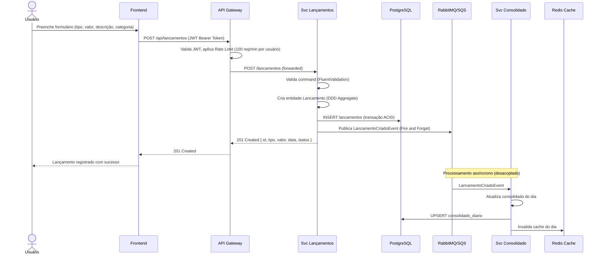
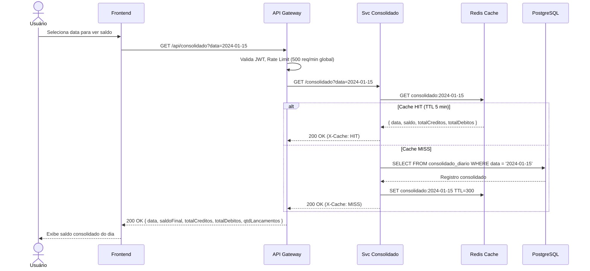

# Visão Geral do Sistema - Fluxo de Caixa

## 1. Objetivo

O sistema de **Fluxo de Caixa** permite que comerciantes controlem seus lançamentos financeiros diários (débitos e créditos) e consultem relatórios de saldo consolidado por período. O sistema é projetado com foco em **alta disponibilidade**, **resiliência** e **desempenho**.

---

## 2. Diagrama de Contexto (C4 - Nível 1)

---

## 3. Diagrama de Containers (C4 - Nível 2)

---

## 4. Atores do Sistema

| Ator | Descrição | Permissões |
|------|-----------|------------|
| **Comerciante** | Usuário operacional que registra lançamentos no dia a dia | Criar/cancelar lançamentos, consultar próprios lançamentos e saldo |
| **Gestor/Contador** | Usuário gerencial que analisa dados financeiros | Consultar todos os lançamentos, relatórios consolidados, exportar dados |
| **Sistema de Consolidado** | Serviço interno que processa eventos de lançamento | Consumir eventos via broker, atualizar saldo consolidado |
| **Administrador** | Responsável pela configuração e manutenção do sistema | Acesso total, configurações, auditoria |

---

## 5. Funcionalidades Principais

### 5.1 Serviço de Lançamentos
- Registrar crédito (entrada de dinheiro)
- Registrar débito (saída de dinheiro)
- Cancelar lançamento (soft delete com motivo)
- Listar lançamentos por data com paginação
- Consultar lançamento por ID
- Exportar lançamentos em CSV/PDF

### 5.2 Serviço de Consolidado Diário
- Calcular saldo consolidado por data
- Consultar histórico de saldos (período)
- Saldo em tempo real (eventual consistency via eventos)
- Cache de 5 minutos para alta disponibilidade sob carga

---

## 6. Fluxo Principal - Registro de Lançamento

---

## 7. Fluxo - Consulta de Consolidado Diário

---

## 8. Regras de Negócio Resumidas

| ID | Regra |
|----|-------|
| RN001 | Todo lançamento deve ter tipo (CREDITO ou DEBITO), valor > 0 e data |
| RN002 | Valor mínimo: R$ 0,01 — Valor máximo: R$ 9.999.999,99 |
| RN003 | Um lançamento cancelado não pode ser reativado |
| RN004 | O saldo pode ser negativo (sem bloqueio operacional) |
| RN005 | O consolidado reflete o saldo acumulado até a data solicitada |
| RN006 | Lançamentos de datas futuras são permitidos mas sinalizados |
| RN007 | O serviço de Lançamentos funciona independentemente do Consolidado |
| RN008 | Consolidado com eventual consistency (máximo 30s de defasagem) |

---

## 9. Requisitos Não-Funcionais

| Requisito | Meta | Estratégia |
|-----------|------|-----------|
| Disponibilidade | 99,9% (8,7h downtime/ano) | Multi-AZ, health checks, circuit breaker |
| Lançamentos - Latência | P99 < 200ms | Cache de validações, índices otimizados |
| Consolidado - Throughput | 50 req/s com < 5% de perda | Redis cache, auto-scaling ECS |
| Consolidado - Latência | P99 < 100ms (cache hit) | TTL 5min no Redis |
| Resiliência | Lançamentos independente do Consolidado | Mensageria assíncrona (SQS/RabbitMQ) |
| Segurança | JWT + Rate Limit + WAF + TLS 1.2+ | AWS WAF, API Gateway, AWS Shield |
| LGPD | Dados sensíveis criptografados | KMS at-rest, TLS in-transit |
