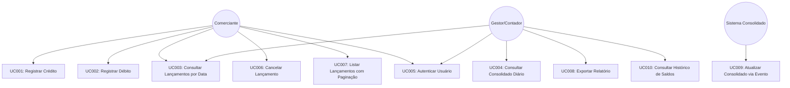
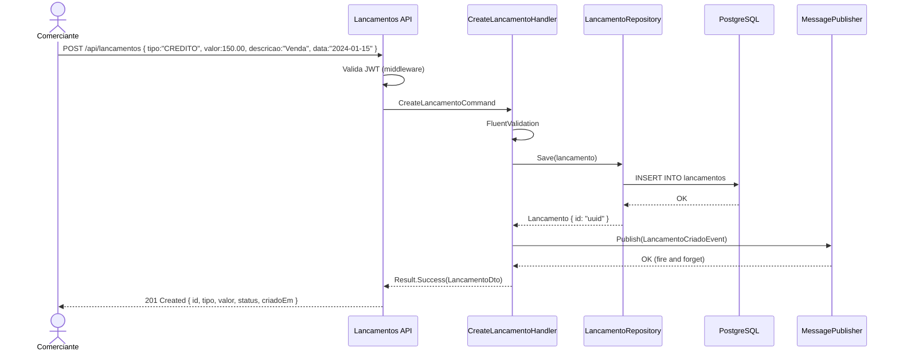
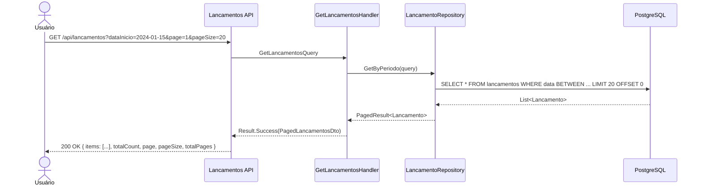
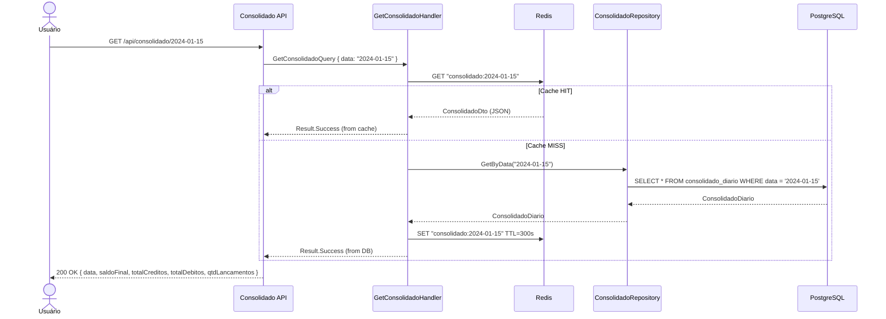
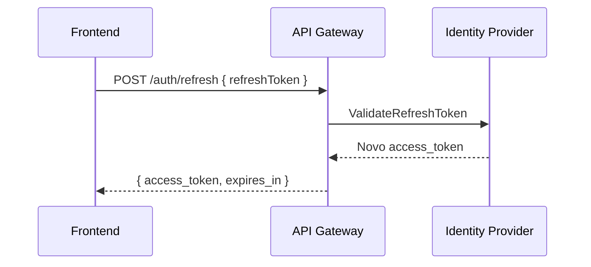
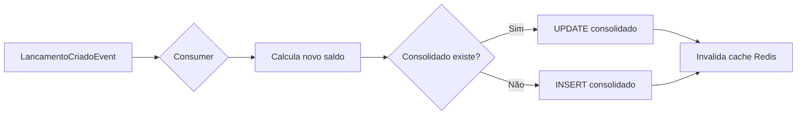

# Casos de Uso - Fluxo de Caixa

## Diagrama Geral de Casos de Uso



---

## UC001 - Registrar Lançamento de Crédito

| Campo | Detalhe |
|-------|---------|
| **ID** | UC001 |
| **Nome** | Registrar Lançamento de Crédito |
| **Ator Principal** | Comerciante |
| **Pré-condições** | Usuário autenticado (JWT válido); Serviço de Lançamentos disponível |
| **Pós-condições** | Lançamento persistido; Evento publicado na fila; Consolidado atualizado assincronamente |

### Fluxo Principal
1. Usuário acessa tela de novo lançamento
2. Seleciona tipo = **CREDITO**
3. Informa: valor (R$), descrição, categoria, data (padrão: hoje)
4. Sistema valida campos obrigatórios e regras de negócio
5. Sistema persiste lançamento com status **ATIVO**
6. Sistema publica `LancamentoCriadoEvent` no broker
7. Sistema retorna 201 Created com dados do lançamento

### Fluxos Alternativos
- **4a**: Valor inválido (≤ 0 ou > 9.999.999,99) → retorna 422 Unprocessable Entity
- **4b**: Descrição ausente → retorna 400 Bad Request
- **4c**: Data futura informada → aceita com flag `dataFutura: true`

### Diagrama de Sequência


---

## UC002 - Registrar Lançamento de Débito

| Campo | Detalhe |
|-------|---------|
| **ID** | UC002 |
| **Nome** | Registrar Lançamento de Débito |
| **Ator Principal** | Comerciante |
| **Pré-condições** | Usuário autenticado; Serviço disponível |
| **Pós-condições** | Débito persistido; Consolidado atualizado assincronamente (saldo pode ficar negativo) |

### Fluxo Principal
1. Usuário seleciona tipo = **DEBITO**
2. Informa: valor, descrição, categoria, data
3. Sistema valida (mesmo fluxo UC001, tipo diferente)
4. Persiste com sinal negativo na lógica de saldo
5. Publica evento `LancamentoCriadoEvent` com tipo DEBITO

### Regras Específicas
- Saldo **pode ficar negativo** — sem bloqueio operacional
- Débito é registrado com valor positivo no campo `valor`, o tipo indica subtração no consolidado

---

## UC003 - Consultar Lançamentos por Data

| Campo | Detalhe |
|-------|---------|
| **ID** | UC003 |
| **Nome** | Consultar Lançamentos por Data |
| **Ator Principal** | Comerciante, Gestor |
| **Pré-condições** | Usuário autenticado |
| **Pós-condições** | Lista de lançamentos retornada |

### Parâmetros de Entrada
| Parâmetro | Tipo | Obrigatório | Padrão |
|-----------|------|-------------|--------|
| `dataInicio` | date | Sim | - |
| `dataFim` | date | Não | dataInicio |
| `tipo` | enum (CREDITO/DEBITO) | Não | Todos |
| `status` | enum (ATIVO/CANCELADO) | Não | ATIVO |
| `page` | int | Não | 1 |
| `pageSize` | int | Não | 20 |

### Diagrama de Sequência


---

## UC004 - Consultar Consolidado Diário

| Campo | Detalhe |
|-------|---------|
| **ID** | UC004 |
| **Nome** | Consultar Consolidado Diário |
| **Ator Principal** | Comerciante, Gestor |
| **Pré-condições** | Usuário autenticado |
| **Pós-condições** | Saldo consolidado retornado (cache ou banco) |

### Diagrama de Sequência


---

## UC005 - Autenticar Usuário

| Campo | Detalhe |
|-------|---------|
| **ID** | UC005 |
| **Nome** | Autenticar Usuário |
| **Ator Principal** | Comerciante, Gestor |
| **Pré-condições** | Usuário cadastrado no Identity Provider |
| **Pós-condições** | JWT Access Token e Refresh Token emitidos |

### Fluxo Principal
1. Usuário informa email e senha
2. Sistema valida credenciais no Identity Provider (AWS Cognito / Keycloak)
3. Sistema retorna `access_token` (JWT, exp: 1h) e `refresh_token` (exp: 7d)
4. Frontend armazena tokens (memory + secure cookie)
5. Requisições subsequentes incluem `Authorization: Bearer {token}`

### Fluxo de Refresh


---

## UC006 - Cancelar Lançamento

| Campo | Detalhe |
|-------|---------|
| **ID** | UC006 |
| **Nome** | Cancelar Lançamento |
| **Ator Principal** | Comerciante (próprio lançamento), Gestor (qualquer) |
| **Pré-condições** | Lançamento existe e está com status ATIVO |
| **Pós-condições** | Lançamento com status CANCELADO; Consolidado reverso publicado |

### Regras
- Lançamento cancelado **não** pode ser reativado (imutável)
- Cancelamento publica `LancamentoCanceladoEvent` para reverter o consolidado
- Motivo de cancelamento é obrigatório (mínimo 10 caracteres)
- Somente o próprio comerciante pode cancelar seus lançamentos (ou gestor)

---

## UC007 - Listar Lançamentos com Paginação e Filtros

### Parâmetros Suportados
```
GET /api/lancamentos
  ?dataInicio=2024-01-01
  &dataFim=2024-01-31
  &tipo=CREDITO
  &status=ATIVO
  &categoria=VENDAS
  &valorMin=100.00
  &valorMax=5000.00
  &ordenarPor=valor
  &ordem=desc
  &page=1
  &pageSize=50
```

### Response
```json
{
  "items": [
    {
      "id": "uuid",
      "tipo": "CREDITO",
      "valor": 1500.00,
      "descricao": "Venda produto X",
      "categoria": "VENDAS",
      "data": "2024-01-15",
      "status": "ATIVO",
      "criadoEm": "2024-01-15T10:30:00Z",
      "criadoPor": "usuario@email.com"
    }
  ],
  "totalCount": 245,
  "page": 1,
  "pageSize": 50,
  "totalPages": 5
}
```

---

## UC008 - Exportar Relatório

| Campo | Detalhe |
|-------|---------|
| **ID** | UC008 |
| **Nome** | Exportar Relatório |
| **Ator Principal** | Gestor |
| **Formatos** | CSV, PDF |

### Fluxo
1. Gestor seleciona período e filtros
2. Sistema gera relatório assincronamente (jobs)
3. Sistema notifica via e-mail com link de download
4. Link válido por 24h (S3 Pre-signed URL)

---

## UC009 - Atualizar Consolidado via Evento (Interno)

| Campo | Detalhe |
|-------|---------|
| **ID** | UC009 |
| **Nome** | Processar Evento de Lançamento |
| **Ator Principal** | Sistema (consumer RabbitMQ/SQS) |

### Fluxo


---

## UC010 - Consultar Histórico de Saldos

### Request
```
GET /api/consolidado/historico?dataInicio=2024-01-01&dataFim=2024-01-31
```

### Response
```json
{
  "periodo": { "inicio": "2024-01-01", "fim": "2024-01-31" },
  "consolidados": [
    {
      "data": "2024-01-01",
      "saldoInicial": 0.00,
      "totalCreditos": 5000.00,
      "totalDebitos": 2000.00,
      "saldoFinal": 3000.00,
      "qtdLancamentos": 15
    }
  ],
  "resumo": {
    "totalCreditosPeriodo": 150000.00,
    "totalDebitosPeriodo": 80000.00,
    "saldoLiquidoPeriodo": 70000.00
  }
}
```
