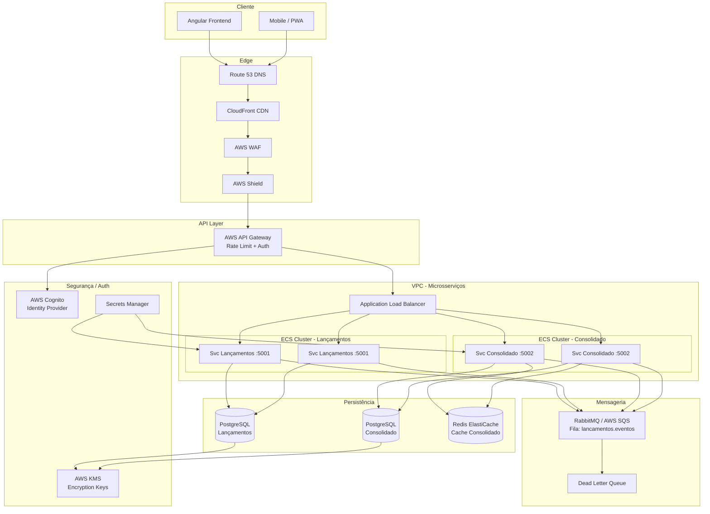
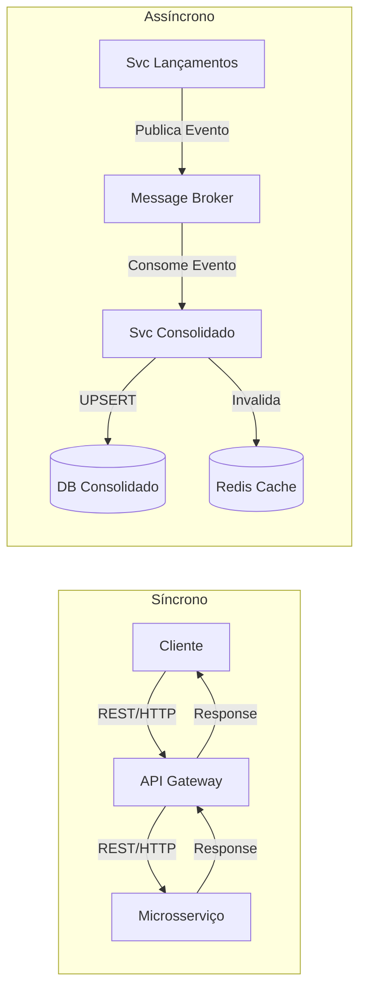
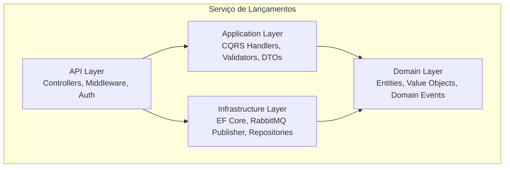
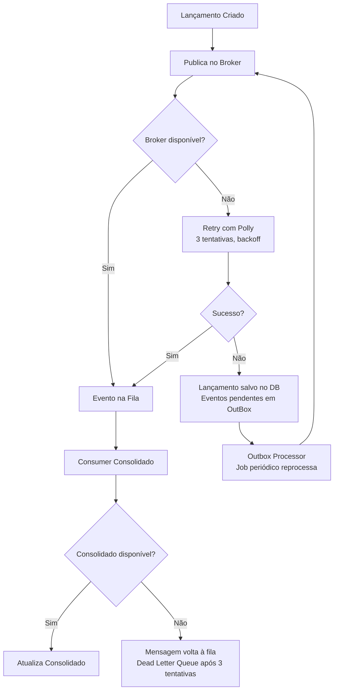

# Arquitetura da Solução - Fluxo de Caixa

## 1. Visão Arquitetural

A solução adota uma arquitetura de **microsserviços** com comunicação **síncrona** (REST) para operações de leitura e **assíncrona** (eventos via broker) para propagação de lançamentos ao consolidado. Isso garante que o serviço de lançamentos permaneça disponível independentemente do consolidado.



---

## 2. Padrão de Comunicação



### Justificativa
- **Síncrono** para lançamentos: o usuário precisa de confirmação imediata do registro
- **Assíncrono** para consolidado: desacopla os serviços; se o consolidado cair, lançamentos continuam funcionando
- Essa decisão atende diretamente ao requisito não-funcional crítico: *"O serviço de lançamento não deve ficar indisponível se o consolidado cair"*

---

## 3. Estrutura do Projeto

```
fluxocaixa/
├── src/
│   ├── FluxoCaixa.Lancamentos/
│   │   ├── FluxoCaixa.Lancamentos.API/          # Controllers, Middleware, DI
│   │   ├── FluxoCaixa.Lancamentos.Application/  # CQRS: Commands, Queries, Handlers
│   │   ├── FluxoCaixa.Lancamentos.Domain/       # Entidades, Value Objects, Events
│   │   └── FluxoCaixa.Lancamentos.Infrastructure/ # EF Core, RabbitMQ, Repositories
│   ├── FluxoCaixa.Consolidado/
│   │   ├── FluxoCaixa.Consolidado.API/
│   │   ├── FluxoCaixa.Consolidado.Application/
│   │   ├── FluxoCaixa.Consolidado.Domain/
│   │   └── FluxoCaixa.Consolidado.Infrastructure/
│   └── FluxoCaixa.Shared/
│       └── FluxoCaixa.Shared.Kernel/            # Result, PagedResult, Base Entities
├── tests/
│   ├── FluxoCaixa.Lancamentos.UnitTests/
│   ├── FluxoCaixa.Consolidado.UnitTests/
│   └── FluxoCaixa.Integration.Tests/
├── frontend/                                     # Angular 17
├── docs/
└── docker-compose.yml
```

---

## 4. Camadas por Microsserviço (DDD)



---

## 5. Decisões Arquiteturais (ADRs Resumidos)

| # | Decisão | Justificativa | Trade-off |
|---|---------|---------------|-----------|
| ADR-001 | **Microsserviços** em vez de Monolito | Requisito de independência entre Lançamentos e Consolidado | Complexidade operacional maior |
| ADR-002 | **CQRS** com MediatR | Separação clara de leitura/escrita, testabilidade, escalabilidade independente | Mais código boilerplate |
| ADR-003 | **RabbitMQ / SQS** para eventos | Desacopla serviços, garante entrega mesmo com falhas | Eventual consistency no consolidado |
| ADR-004 | **Redis** para cache do Consolidado | Suporta 50 req/s com < 5% perda sem pressão no banco | Dados com até 5min de defasagem |
| ADR-005 | **PostgreSQL** como banco relacional | ACID, JSON support, excelente suporte a .NET via EF Core | Não é nativo de cloud como DynamoDB |
| ADR-006 | **JWT** com AWS Cognito | Stateless, escalável, integração nativa com API Gateway | Necessita validação de issuer |
| ADR-007 | **Result Pattern** em vez de exceções | Controle de fluxo explícito, sem try/catch espalhados | Mais verboso |
| ADR-008 | **ECS Fargate** em vez de Lambda | Latência previsível, sem cold start, controle de recursos | Custo fixo mesmo em idle |

---

## 6. Fluxo de Resiliência



**Padrão Outbox**: Garante que eventos sejam publicados mesmo se o broker estiver indisponível no momento do lançamento. O lançamento é salvo + evento gravado na tabela `outbox` em uma única transação. Um job periódico publica os eventos pendentes.
