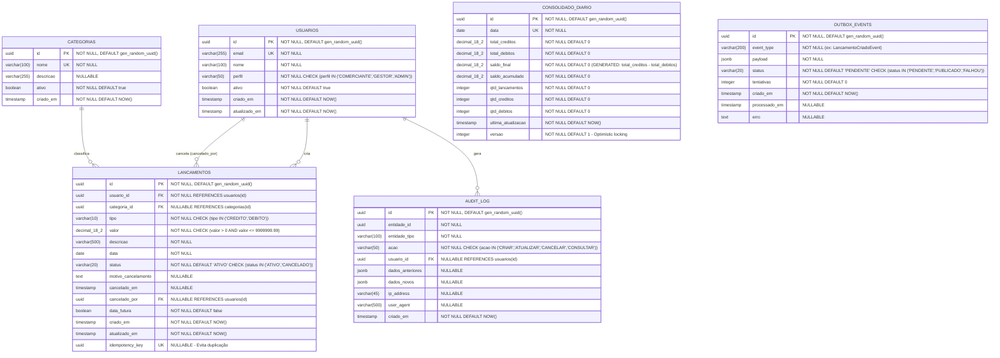
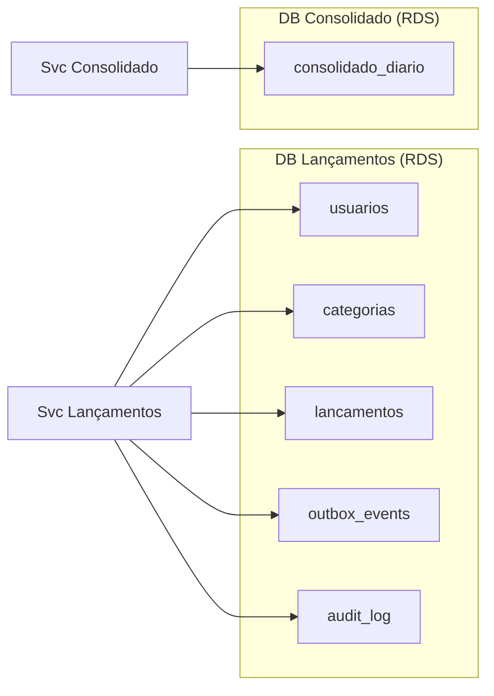

# Modelo de Entidade-Relacionamento (MER)

## Diagrama ER Completo

---

## Descrição Detalhada das Tabelas

### `usuarios`
Armazena usuários do sistema. Na prática com AWS Cognito, esta tabela pode ser um espelho local para JOIN com outras entidades.

| Coluna | Tipo | Nullable | Descrição |
|--------|------|----------|-----------|
| `id` | UUID | NOT NULL | PK, gerado automaticamente |
| `email` | VARCHAR(255) | NOT NULL | E-mail único, chave de negócio |
| `nome` | VARCHAR(100) | NOT NULL | Nome completo |
| `perfil` | VARCHAR(50) | NOT NULL | COMERCIANTE, GESTOR ou ADMIN |
| `ativo` | BOOLEAN | NOT NULL | Soft delete |
| `criado_em` | TIMESTAMP WITH TZ | NOT NULL | Auditoria |
| `atualizado_em` | TIMESTAMP WITH TZ | NOT NULL | Auditoria |

**Índices**:
- `idx_usuarios_email` UNIQUE on `email`

---

### `categorias`
Categorias de lançamento (ex: VENDAS, COMPRAS, TAXA, SALÁRIO).

| Coluna | Tipo | Nullable | Descrição |
|--------|------|----------|-----------|
| `id` | UUID | NOT NULL | PK |
| `nome` | VARCHAR(100) | NOT NULL | Nome único da categoria |
| `descricao` | VARCHAR(255) | NULL | Descrição opcional |
| `ativo` | BOOLEAN | NOT NULL | Soft delete |

---

### `lancamentos`
Tabela principal do Serviço de Lançamentos. Recebe todos os débitos e créditos.

| Coluna | Tipo | Nullable | Descrição |
|--------|------|----------|-----------|
| `id` | UUID | NOT NULL | PK |
| `usuario_id` | UUID | NOT NULL | FK → usuarios.id |
| `categoria_id` | UUID | NULL | FK → categorias.id |
| `tipo` | VARCHAR(10) | NOT NULL | CREDITO ou DEBITO |
| `valor` | DECIMAL(18,2) | NOT NULL | Valor positivo (tipo define sinal) |
| `descricao` | VARCHAR(500) | NOT NULL | Descrição do lançamento |
| `data` | DATE | NOT NULL | Data do lançamento |
| `status` | VARCHAR(20) | NOT NULL | ATIVO ou CANCELADO |
| `motivo_cancelamento` | TEXT | NULL | Preenchido ao cancelar |
| `cancelado_em` | TIMESTAMP WITH TZ | NULL | Data/hora do cancelamento |
| `cancelado_por` | UUID | NULL | FK → usuarios.id |
| `data_futura` | BOOLEAN | NOT NULL | Flag se data > hoje |
| `idempotency_key` | UUID | NULL | Evita duplicação de POST |
| `criado_em` | TIMESTAMP WITH TZ | NOT NULL | Auditoria |
| `atualizado_em` | TIMESTAMP WITH TZ | NOT NULL | Auditoria |

**Índices**:
- `idx_lancamentos_data` on `data` — principal filtro
- `idx_lancamentos_usuario_data` on `(usuario_id, data)` — filtro por usuário/data
- `idx_lancamentos_tipo_status` on `(tipo, status)` — filtros de busca
- `idx_lancamentos_idempotency` UNIQUE on `idempotency_key`
- `idx_lancamentos_status` PARTIAL on `status = 'ATIVO'` — otimiza listagem ativa

---

### `consolidado_diario`
Tabela do Serviço de Consolidado. Atualizada via eventos assíncronos.

| Coluna | Tipo | Nullable | Descrição |
|--------|------|----------|-----------|
| `id` | UUID | NOT NULL | PK |
| `data` | DATE | NOT NULL | UK — um registro por dia |
| `total_creditos` | DECIMAL(18,2) | NOT NULL | Soma de todos os créditos do dia |
| `total_debitos` | DECIMAL(18,2) | NOT NULL | Soma de todos os débitos do dia |
| `saldo_final` | DECIMAL(18,2) | NOT NULL | total_creditos - total_debitos |
| `saldo_acumulado` | DECIMAL(18,2) | NOT NULL | Saldo anterior + saldo_final |
| `qtd_lancamentos` | INTEGER | NOT NULL | Total de lançamentos ativos do dia |
| `qtd_creditos` | INTEGER | NOT NULL | Quantidade de créditos |
| `qtd_debitos` | INTEGER | NOT NULL | Quantidade de débitos |
| `ultima_atualizacao` | TIMESTAMP WITH TZ | NOT NULL | Última atualização via evento |
| `versao` | INTEGER | NOT NULL | Optimistic locking |

**Índices**:
- `idx_consolidado_data` UNIQUE on `data` — busca por data é O(log n)
- `idx_consolidado_data_range` on `data` — consulta de período

---

### `outbox_events`
Implementa o Outbox Pattern para garantia de entrega de eventos.

| Coluna | Tipo | Nullable | Descrição |
|--------|------|----------|-----------|
| `id` | UUID | NOT NULL | PK |
| `event_type` | VARCHAR(200) | NOT NULL | Nome do evento (ex: LancamentoCriadoEvent) |
| `payload` | JSONB | NOT NULL | Dados do evento em JSON |
| `status` | VARCHAR(20) | NOT NULL | PENDENTE, PUBLICADO, FALHOU |
| `tentativas` | INTEGER | NOT NULL | Contador de tentativas de publicação |
| `criado_em` | TIMESTAMP WITH TZ | NOT NULL | Criado junto com o lançamento |
| `processado_em` | TIMESTAMP WITH TZ | NULL | Quando foi publicado com sucesso |
| `erro` | TEXT | NULL | Mensagem de erro se falhou |

**Índices**:
- `idx_outbox_status_criado` on `(status, criado_em)` — job de processamento

---

### `audit_log`
Log imutável de todas as operações relevantes para auditoria e LGPD.

| Coluna | Tipo | Nullable | Descrição |
|--------|------|----------|-----------|
| `id` | UUID | NOT NULL | PK |
| `entidade_id` | UUID | NOT NULL | ID da entidade afetada |
| `entidade_tipo` | VARCHAR(100) | NOT NULL | Nome da classe (Lancamento, etc.) |
| `acao` | VARCHAR(50) | NOT NULL | CRIAR, ATUALIZAR, CANCELAR |
| `usuario_id` | UUID | NULL | FK → usuarios.id (null se sistema) |
| `dados_anteriores` | JSONB | NULL | Estado antes da operação |
| `dados_novos` | JSONB | NULL | Estado após a operação |
| `ip_address` | VARCHAR(45) | NULL | IP do cliente (IPv4/IPv6) |
| `user_agent` | VARCHAR(500) | NULL | Browser/cliente |
| `criado_em` | TIMESTAMP WITH TZ | NOT NULL | Imutável |

---

## Separação de Banco por Serviço

Cada microsserviço possui seu **próprio banco de dados** (Database per Service pattern). Isso garante isolamento total e independência operacional.
